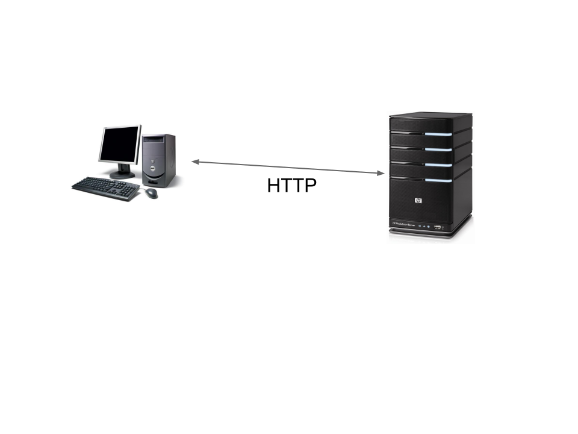
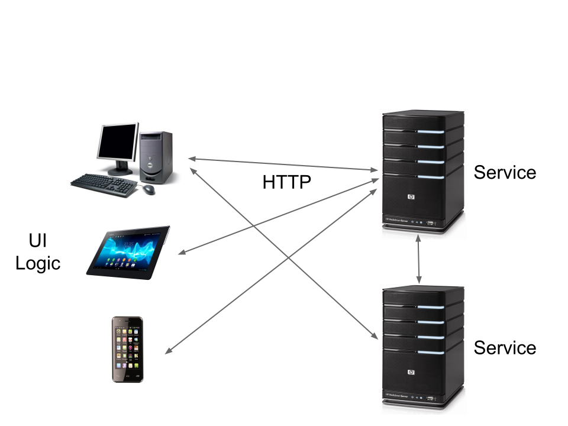

% Scala.js with Play
% Sébastien Doeraene <sebastien.doeraene@epfl.ch>
  Julien Richard-Foy <julien.richard-foy@epfl.ch>
   
  HEIG-VD -- 2017
   
   
  [http://julienrf.github.io/2017/scalajs-with-play](http://julienrf.github.io/2017/scalajs-with-play)

### Outline {.unnumbered}

- Introduction
- Web applications
- Play
- Scala.js
- Play and Scala.js
- Discussion

# Introduction

## Introductory Example

### Title {.unnumbered}

Content

### Another title {.unnumbered}

Content

# Web applications

### What is a web application? {.unnumbered}

### What is a web application? {.unnumbered}

## HTTP

### HTTP requests {.unnumbered}

- Verb (`GET`, `POST`, `PUT`, `DELETE`, …)
- URL
    - host (e.g. `google.com`)
    - path (e.g. `/maps`)
    - query string (e.g. `q=Yverdon&lang=fr`)
- Headers (e.g. `Accept-Language: fr`)
- Entity (e.g. image, JSON document, etc.)

### HTTP responses {.unnumbered}

- Status code
    - Success (2xx)
    - Redirect (3xx)
    - Client failure (4xx)
    - Server failure (5xx)
- Headers (e.g. `ETag: 5d72cb4`)
- Entity

## Scaling out {.unnumbered}

# Play

## Setup

### Sbt setup {.unnumbered}

`project/plugins.sbt`:

~~~ scala
addSbtPlugin("com.typesafe.play" % "sbt-plugin" % "2.5.14")
~~~

`build.sbt`:

~~~ scala
enablePlugins(PlayScala)
~~~

## Controllers and routes

## User session

## Testing

# Scala.js

# Play with Scala.js

## Setup

## Architecture of a web app

## Remote invocations

### Manual way {.unnumbered}

# Summary

# Going further

### Scala.js + React {.unnumbered}

- scalajs-react

### NPM modules {.unnumbered}

- [scalajs-bundler](https://scalacenter.github.io/scalajs-bundler/)

- Add dependencies on NPM packages to your `build.sbt`

~~~ scala
npmDependencies in Compile += "react" -> "15.5.4"
~~~

- Bundle your project and its dependencies into a single file
  executable by a web browser

~~~
> myProject/fullOptJS::webpack
~~~

### Alternative Web frameworks {.unnumbered}

- akka-http
- http4s

### Remote communication {.unnumbered}

- [endpoints](http://julienrf.github.io/endpoints/)

