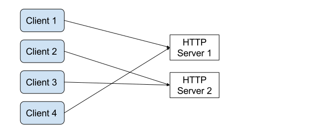

% Scala.js with Play
% Sébastien Doeraene <sebastien.doeraene@epfl.ch>
  Julien Richard-Foy <julien.richard-foy@epfl.ch>
   
  HEIG-VD -- 2017
   
   
  [http://julienrf.github.io/2017/scalajs-with-play](http://julienrf.github.io/2017/scalajs-with-play)

### Outline {.unnumbered}

- Introduction
- Web applications
- Play
- Scala.js
- Play and Scala.js
- Discussion

# Introduction

## Introductory Example

### The Counter {.unnumbered}

# Web applications

### What is a web application? {.unnumbered}

### What is a web application? {.unnumbered}

## HTTP

### HTTP requests {.unnumbered}

~~~
GET https://google.com/maps?q=Yverdon&lang=fr
~~~

- Verb (`GET`, `POST`, `PUT`, `DELETE`, …)
- URL
    - host (e.g. `google.com`)
    - path (e.g. `/maps`)
    - query string (e.g. `q=Yverdon&lang=fr`)
- Headers (e.g. `Accept-Language: fr`)
- Entity (e.g. image, JSON document, etc.)

### HTTP responses {.unnumbered}

- Status code
    - Success (2xx)
    - Redirect (3xx)
    - Client failure (4xx)
    - Server failure (5xx)
- Headers (e.g. `ETag: 5d72cb4`)
- Entity

## Scaling out

### The problem {.unnumbered}

- Your app is successful!
- Too many clients at the same time…
- Buy a more powerful machine to run the web server?
    - Works up to a certain scale only
    - No resilience

### Scaling out HTTP server {.unnumbered}

### Scaling out HTTP server {.unnumbered}

# Play framework

## Setup

### Sbt setup {.unnumbered}

`project/plugins.sbt`:

~~~ scala
addSbtPlugin("com.typesafe.play" % "sbt-plugin" % "2.5.14")
~~~

`build.sbt`:

~~~ scala
enablePlugins(PlayScala)
~~~

### Hot reload {.unnumbered}

- Run your app:

~~~
$ sbt run
~~~

- Go to [http://localhost:9000](http://localhost:9000)

- Edit your code and reload the page in your browser

## Controllers and routes

### Request lifecycle {.unnumbered}

### Routes {.unnumbered}

`conf/routes`:

~~~
GET    /index.html       counter.Counter.index()
~~~

### Controllers {.unnumbered}

`app/counter/Counter.scala`

~~~ scala
package counter

import play.api.mvc.{Action, Controller}

class Counter extends Controller {

  def index = Action { request =>
    Ok("Hello, world!")
  }

}
~~~

### Actions {.unnumbered}

- Handle requests
- Built with the `Action` object
    - Defines how to parse the request entity

~~~ scala
Action { request => Ok }
~~~

~~~ scala
Action(parse.json) { request => Ok((request.body \ "message").get) }
~~~

### Requests {.unnumbered}

~~~ scala
Action { request =>

  request.method // e.g. "GET"
  request.uri // e.g. "/index.html"
  request.headers
  request.acceptedTypes // e.g. Seq("text/html")
  request.body // the request entity

  Ok

}
~~~

### Responses {.unnumbered}

~~~ scala
Ok // empty response with status code 200 (OK)
NotFound // empty response with status code 404 (Not Found)
// etc.
~~~

~~~ scala
Ok("Hello, world!")
Created(Json.obj("id" -> 123))
~~~

~~~ scala
  Ok("<h1>Hello, world!</h1>").withHeader("Content-Type" -> "application/json")
  Ok("Salut").withHeader("Content-Language" -> "fr")
}
~~~

## Concurrency control

### How to handle multiple concurrent requests? {.unnumbered}

- Two main kinds of strategies
    - Multithreaded model
    - Evented model

### Multithreaded model {.unnumbered}

- The framework allocates a new thread for each incoming request
- The runtime environment (e.g. the JVM) manages the execution of each
  thread (with a preemptive scheduler)

### Evented model {.unnumbered}

- Several requests are processed by a same thread
- Each time a request handler does IO it releases the execution thread

### Best execution model? {.unnumbered}

### Concurrency control in Play {.unnumbered}

- Evented first, but you can configure the execution context
  to be multithreaded

### How to release the execution context? {.unnumbered}

~~~ scala
Action { request =>
  val data = myDatabase.requestSomething()
  Ok(Json.toJson(data))
}
~~~

~~~ scala
trait MyDatabase {
  def requestSomething(): Something
}
~~~

### How to release the execution context? {.unnumbered}

~~~ scala
Action.async { request =>
  for {
    data <- myDatabase.requestSomething()
  } yield Ok(Json.toJson(data))
}
~~~

~~~ scala
trait MyDatabase {
  def requestSomething(): Future[Something]
}
~~~

### Asynchronous boundaries {.unnumbered}

~~~ scala
import scala.concurrent.Future
import play.api.libs.concurrent.Execution.Implicits.defaultContext

Future {
  1 + 1
}.map { x =>
  x * 2
}.flatMap { x =>
  Future {
    0
  }.zip(Future {
    1
  }).map { case (y, z) =>
    x + y + z
  }
}
~~~

### Quizz {.unnumbered}

~~~ scala
Future {
  println("foo")
}.zip(Future {
  println("bar")
}).map { _ =>
  println("baz")
}
println("quux")
~~~

What does this program print?

## User session

### Stateless server? {.unnumbered}

### Cookies {.unnumbered}

- Stored on the client, sent by the client with every request

~~~ scala
Action { request =>
  Ok.withCookies(Cookie("preferred-color", "orange"))
}
~~~

### Lang {.unnumbered}

- Based on cookies

~~~ scala
def selectLanguage(lang: Lang) =
  Action { request =>
    Ok.withLang(lang)
  }
~~~

### Session {.unnumbered}

- Based on cookies

~~~ scala
def authenticate(name: String, password: String) =
  Action { implicit request =>
    if (name == "Julien" && password == "foo)
      Redirect("/index.html").addingToSession("role" -> "admin")
    else
      BadRequest("Unknown user")
  }
~~~

~~~ scala
def authenticatedAction = Action { request =>
  if (request.session.get("role").contains("admin")) {
    …
  } else Unauthorized
}
~~~

### Forging a fake session? {.unnumbered}

- Can a client pretend to be an admin just by forging a fake session?

- No, because the content of the session is cryptographically signed
  with a private key

## Running a Play application (and wiring its dependencies) {.unnumbered}

### Where is my “main”? {.unnumbered}

- Play framework provides the application entry point
- Automatically handles the dev vs prod mode for you

### How are the components of the application loaded? {.unnumbered}

`conf/application.conf`

~~~
play.application.loader = "counter.Loader"
~~~

`app/counter/Loader.scala`

~~~ scala
package counter

import play.api.{Application, ApplicationLoader, BuiltInComponentsFromContext}
import router.Routes

class Loader extends ApplicationLoader {
  def load(context: ApplicationLoader.Context): Application = {
    val components = new BuiltInComponentsFromContext(context) {
      val counterController = new Counter
      val router = new Routes(httpErrorHandler, counterController)
    }
    components.application
  }
}
~~~

## Testing

### Scalatest + Play {.unnumbered}

`build.sbt`

~~~ scala
libraryDependencies += "org.scalatestplus.play" %% "scalatestplus-play" % "1.5.1" % Test
~~~

`test/counter/CounterTest.scala`

~~~ scala
package counter

import org.scalatestplus.play.{OneServerPerSuite, PlaySpec}
import play.api.{Application, ApplicationLoader, Environment}

class CounterTest extends PlaySpec with OneServerPerSuite {

  override lazy val app: Application =
    new ApplicationLoader {
      def load(context: ApplicationLoader.Context): Application = {
        new Components(context).application
      }
    }.load(ApplicationLoader.createContext(Environment.simple()))

}
~~~

### Testing an HTTP API {.unnumbered}

~~~ scala
import play.api.test.Helpers._

"test index page" in {
  val response = route(app, FakeRequest("GET", "/")).value
  assert(status(response) === OK)
  assert(contentAsString(response) === "Hello, world!")
}
~~~

### Testing with a web browser {.unnumbered}

~~~ scala
???
~~~

# Scala.js

# Play with Scala.js

## Setup

## Architecture of a web app

## Remote invocations

### Manual way {.unnumbered}

# Summary

# Going further

### Scala.js + React {.unnumbered}

- scalajs-react

### NPM modules {.unnumbered}

- [scalajs-bundler](https://scalacenter.github.io/scalajs-bundler/)

- Add dependencies on NPM packages to your `build.sbt`

~~~ scala
npmDependencies in Compile += "react" -> "15.5.4"
~~~

- Bundle your project and its dependencies into a single file
  executable by a web browser

~~~
> myProject/fullOptJS::webpack
~~~

### Alternative Web frameworks {.unnumbered}

- akka-http
- http4s

### Remote communication {.unnumbered}

- [endpoints](http://julienrf.github.io/endpoints/)

