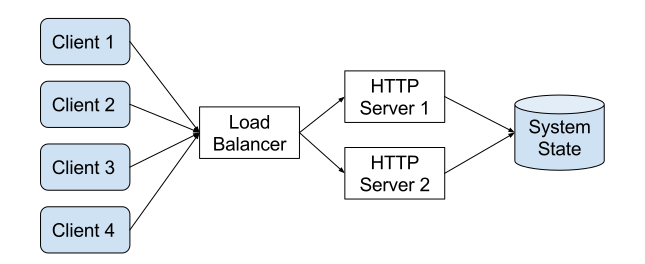
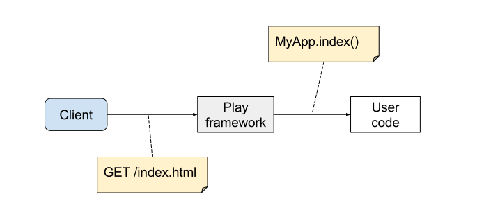

% Scala.js with Play
% Sébastien Doeraene &nbsp;&nbsp;&nbsp; <sebastien.doeraene@epfl.ch>
  Julien Richard-Foy &nbsp;&nbsp;&nbsp; <julien.richard-foy@epfl.ch>
  &nbsp;
  HEIG-VD -- 2017
  &nbsp;
  &nbsp;
  [http://julienrf.github.io/2017/scalajs-with-play](http://julienrf.github.io/2017/scalajs-with-play)

### Outline {.unnumbered}

- Introduction
- Web applications
- Play
- Scala.js
- Play and Scala.js
- Discussion

# Introduction

## Introductory Example

### The Counter {.unnumbered}

# Web applications

### What is a web application? {.unnumbered}

### What is a web application? {.unnumbered}

## HTTP

### HTTP requests {.unnumbered}

~~~
GET https://google.com/maps?q=Yverdon&lang=fr
~~~

- Verb (`GET`, `POST`, `PUT`, `DELETE`, …)
- URL
    - host (e.g. `google.com`)
    - path (e.g. `/maps`)
    - query string (e.g. `q=Yverdon&lang=fr`)
- Headers (e.g. `Accept-Language: fr`)
- Entity (e.g. image, JSON document, etc.)

### HTTP responses {.unnumbered}

- Status code
    - Success (2xx)
    - Redirect (3xx)
    - Client failure (4xx)
    - Server failure (5xx)
- Headers (e.g. `ETag: 5d72cb4`)
- Entity

## Scaling out

### The problem {.unnumbered}

- Your app is successful!
- Too many clients at the same time…
- Buy a more powerful machine to run the web server?
    - Works up to a certain scale only
    - No resilience

### Scaling out HTTP server {.unnumbered}

### Scaling out HTTP server {.unnumbered}

# Play framework

## Setup

### Sbt setup {.unnumbered}

`project/plugins.sbt`:

~~~ scala
addSbtPlugin("com.typesafe.play" % "sbt-plugin" % "2.5.14")
~~~

`build.sbt`:

~~~ scala
enablePlugins(PlayScala)
~~~

### Hot reload {.unnumbered}

- Run your app:

~~~
$ sbt run
~~~

- Go to [http://localhost:9000](http://localhost:9000)

- Edit your code and reload the page in your browser

## Controllers and routes

### Request lifecycle {.unnumbered}

### Routes {.unnumbered}

`conf/routes`:

~~~
GET    /index.html       counter.Counter.index()
~~~

### Controllers {.unnumbered}

`app/counter/Counter.scala`

~~~ scala
package counter

import play.api.mvc.{Action, Controller}

class Counter extends Controller {

  def index = Action { request =>
    Ok("Hello, world!")
  }

}
~~~

### Actions {.unnumbered}

- Handle requests
- Built with the `Action` object
    - Defines how to parse the request entity

~~~ scala
Action { request => Ok }
~~~

~~~ scala
Action(parse.json) { request => Ok((request.body \ "message").get) }
~~~

### Requests {.unnumbered}

~~~ scala
Action { request =>

  request.method // e.g. "GET"
  request.uri // e.g. "/index.html"
  request.headers
  request.acceptedTypes // e.g. Seq("text/html")
  request.body // the request entity

  Ok

}
~~~

### Responses {.unnumbered}

~~~ scala
Ok // empty response with status code 200 (OK)
NotFound // empty response with status code 404 (Not Found)
// etc.
~~~

~~~ scala
Ok("Hello, world!")
Created(Json.obj("id" -> 123))
~~~

~~~ scala
  Ok("<h1>Hello, world!</h1>").withHeader("Content-Type" -> "application/json")
  Ok("Salut").withHeader("Content-Language" -> "fr")
}
~~~

## Concurrency control

### How to handle multiple concurrent requests? {.unnumbered}

- Two main kinds of strategies
    - Multithreaded model
    - Evented model

### Multithreaded model {.unnumbered}

- The framework allocates a new thread for each incoming request
- The runtime environment (e.g. the JVM) manages the execution of each
  thread (with a preemptive scheduler)

### Evented model {.unnumbered}

- Several requests are processed by a same thread
- Each time a request handler does IO it releases the execution thread

### Best execution model? {.unnumbered}

### Concurrency control in Play {.unnumbered}

- Evented first, but you can configure the execution context
  to be multithreaded

### How to release the execution context? {.unnumbered}

~~~ scala
Action { request =>
  val data = myDatabase.requestSomething()
  Ok(Json.toJson(data))
}
~~~

~~~ scala
trait MyDatabase {
  def requestSomething(): Something
}
~~~

### How to release the execution context? {.unnumbered}

~~~ scala
Action.async { request =>
  for {
    data <- myDatabase.requestSomething()
  } yield Ok(Json.toJson(data))
}
~~~

~~~ scala
trait MyDatabase {
  def requestSomething(): Future[Something]
}
~~~

### Asynchronous boundaries {.unnumbered}

~~~ scala
import scala.concurrent.Future
import play.api.libs.concurrent.Execution.Implicits.defaultContext

Future {
  1 + 1
}.map { x =>
  x * 2
}.flatMap { x =>
  Future {
    0
  }.zip(Future {
    1
  }).map { case (y, z) =>
    x + y + z
  }
}
~~~

### Quizz {.unnumbered}

~~~ scala
Future {
  println("foo")
}.zip(Future {
  println("bar")
}).map { _ =>
  println("baz")
}
println("quux")
~~~

What does this program print?

## User session

### Stateless server? {.unnumbered}

### Cookies {.unnumbered}

- Stored on the client, sent by the client with every request

~~~ scala
Action { request =>
  Ok.withCookies(Cookie("preferred-color", "orange"))
}
~~~

### Lang {.unnumbered}

- Based on cookies

~~~ scala
def selectLanguage(lang: Lang) =
  Action { request =>
    Ok.withLang(lang)
  }
~~~

### Session {.unnumbered}

- Based on cookies

~~~ scala
def authenticate(name: String, password: String) =
  Action { implicit request =>
    if (name == "Julien" && password == "foo)
      Redirect("/index.html").addingToSession("role" -> "admin")
    else
      BadRequest("Unknown user")
  }
~~~

~~~ scala
def authenticatedAction = Action { request =>
  if (request.session.get("role").contains("admin")) {
    …
  } else Unauthorized
}
~~~

### Forging a fake session? {.unnumbered}

- Can a client pretend to be an admin just by forging a fake session?

- No, because the content of the session is cryptographically signed
  with a private key

## Running a Play application (and wiring its dependencies) {.unnumbered}

### Where is my “main”? {.unnumbered}

- Play framework provides the application entry point
- Automatically handles the dev vs prod mode for you

### How are the components of the application loaded? {.unnumbered}

`conf/application.conf`

~~~
play.application.loader = "counter.Loader"
~~~

`app/counter/Loader.scala`

~~~ scala
package counter

import play.api.{Application, ApplicationLoader, BuiltInComponentsFromContext}
import router.Routes

class Loader extends ApplicationLoader {
  def load(context: ApplicationLoader.Context): Application = {
    val components = new BuiltInComponentsFromContext(context) {
      val counterController = new Counter
      val router = new Routes(httpErrorHandler, counterController)
    }
    components.application
  }
}
~~~

## Testing

### Scalatest + Play {.unnumbered}

`build.sbt`

~~~ scala
libraryDependencies += "org.scalatestplus.play" %% "scalatestplus-play" % "1.5.1" % Test
~~~

`test/counter/CounterSpec.scala`

~~~ scala
package counter

import org.scalatestplus.play.{OneServerPerSuite, PlaySpec}
import play.api.{Application, ApplicationLoader, Environment}

trait CounterSpec extends PlaySpec with OneServerPerSuite {

  override lazy val app: Application =
    (new Loader).load(ApplicationLoader.createContext(Environment.simple()))

}
~~~

### Testing an HTTP API {.unnumbered}

~~~ scala
package counter

import play.api.test.FakeRequest
import play.api.test.Helpers._

class CounterCtlTest extends CounterSpec {

  "test index page" in {
    val response = route(app, FakeRequest("GET", "/greet")).value
    assert(status(response) === OK)
    assert(contentAsString(response) === "Hello, world!")
  }

}
~~~

### Testing with a web browser {.unnumbered}

~~~ scala
package counter

import org.scalatestplus.play.{ChromeFactory, OneBrowserPerSuite}

class CounterUiTest
  extends CounterSpec
    with OneBrowserPerSuite
    with ChromeFactory {

  System.setProperty("webdriver.chrome.driver", "/home/julien/chromedriver")

  // …
}
~~~

### Testing with a web browser {.unnumbered}

~~~ scala
"increment" in {
  go to s"http://localhost:$port${routes.CounterCtl.index().url}"
  eventually(id("counter").element)
  val counterElem = id("counter").element
  assert(counterElem.text == "0")
  click on id("inc")
  eventually(assert(counterElem.text == "1"))
}
~~~

# Scala.js

## Introduction

### Scala for the JVM {.unnumbered}

### Scala for JS platforms {.unnumbered}

### Things to install {.unnumbered}

* [Node.js](https://nodejs.org/en/)
* Recommended: run `npm install source-map-support` in your project directory

### Hello world {.unnumbered}

~~~ scala
package hello

import scala.scalajs.js

object Main extends js.JSApp {
  def main(): Unit = {
    println("Hello world")
  }
}
~~~

### sbt setup {.unnumbered}

`project/plugins.sbt`:

~~~ scala
addSbtPlugin("org.scala-js" % "sbt-scalajs" % "0.6.16")
~~~

`build.sbt`:

~~~ scala
enablePlugins(ScalaJSPlugin)

// There is a main JSApp in this Scala.js project
scalaJSUseMainModuleInitializer := true
~~~

### Run it with Node.js {.unnumbered}

~~~
$ sbt
...
> run
[info] Compiling 1 Scala source to .../target/scala-2.11/classes...
[info] Fast optimizing .../target/scala-2.11/standaloneclient-fastopt.js
[info] Running hello.Main
Hello world
[success] Total time: 3 s, completed May 15, 2017 2:58:22 PM
~~~

### Run it in a browser {.unnumbered}

~~~
> fastOptJS
...
~~~

~~~ html
<html>
  <head>
    <title>Hello world</title>
    <meta charset="utf-8" />
  </head>
  <body>
    
  </body>
</html>
~~~

### Manipulate the web page {.unnumbered}

`build.sbt`:

~~~ scala
libraryDependencies ++= Seq(
  "org.scala-js" %%% "scalajs-dom" % "0.9.2"
)
~~~

`Main.scala`:

~~~ scala
import scala.scalajs.js
import org.scalajs.dom

object Main extends js.JSApp {
  def main(): Unit = {
    val p = dom.document.createElement("p")
    p.innerHTML = "Hello world"
    dom.document.body.appendChild(p)
  }
}
~~~

## A client-only counter application

### A basic HTML view {.unnumbered}

~~~ html

  <h1 id="counter">0</h1>
  
<input id="step" type="number" value="1" />

  

    <button id="inc">Increment</button>
    <button id="reset">Reset</button>
  

~~~

### Bare DOM manipulation {.unnumbered}

* Document Object Model (DOM)
* A set of JavaScript APIs, part of the browsers, allowing to manipulate the Web page
* Can manipulate the "static" structure of the page (the HTML)
* Can also add *event listeners* to respond to events happening on the page
* [Comprehensive documention on MDN](https://developer.mozilla.org/en-US/docs/Web/API/Document_Object_Model)
  ([French version](https://developer.mozilla.org/fr/docs/DOM) -- not always as complete)

### A simple event listener {.unnumbered}

~~~ scala
import scala.scalajs.js
import org.scalajs.dom
import org.scalajs.dom.html

object Main extends js.JSApp {
  lazy val incButton =
    dom.document.getElementById("inc").asInstanceOf[html.Button]

  def main(): Unit = {
    incButton.addEventListener("click", { (e: dom.MouseEvent) =>
      dom.window.alert("The 'increment' button was clicked")
    })
  }
}
~~~

### Actually increment the counter {.unnumbered}

~~~ scala
object Main extends js.JSApp {
  var counter: Int = 0

  lazy val counterHeading =
    dom.document.getElementById("counter").asInstanceOf[html.Heading]
  lazy val incButton =
    dom.document.getElementById("inc").asInstanceOf[html.Button]

  def main(): Unit = {
    incButton.addEventListener("click", { (e: dom.MouseEvent) =>
      counter += 1
      counterHeading.textContent = counter.toString()
    })
  }
}
~~~

### Take the step into account {.unnumbered}

~~~ scala
object Main extends js.JSApp {
  var counter: Int = 0

  lazy val counterHeading =
    dom.document.getElementById("counter").asInstanceOf[html.Heading]
  lazy val stepInput =
    dom.document.getElementById("step").asInstanceOf[html.Input]
  lazy val incButton =
    dom.document.getElementById("inc").asInstanceOf[html.Button]

  def main(): Unit = {
    incButton.addEventListener("click", { (e: dom.MouseEvent) =>
      val step = stepInput.value.toInt // value is a String
      counter += step
      counterHeading.textContent = counter.toString()
    })
  }
}
~~~

### Reset {.unnumbered}

~~~ scala
object Main extends js.JSApp {
  var counter: Int = 0

  // ...
  lazy val resetButton =
    dom.document.getElementById("reset").asInstanceOf[html.Button]

  def main(): Unit = {
    incButton.addEventListener("click", { (e: dom.MouseEvent) =>
      val step = stepInput.value.toInt // value is a String
      counter += step
      counterHeading.textContent = counter.toString()
    })

    resetButton.addEventListener("click", { (e: dom.MouseEvent) =>
      counter = 0
      counterHeading.textContent = counter.toString()
      // ^ uh oh, this looks repetitive
    })
  }
}
~~~

### Managing the state (sort of) {.unnumbered}

~~~ scala
object Main extends js.JSApp {
  var counter: Int = 0

  // ...
  def updateCounter(newCounter: Int): Unit = {
    counter = newCounter
    counterHeading.textContent = counter.toString()
  }

  def main(): Unit = {
    incButton.addEventListener("click", { (e: dom.MouseEvent) =>
      val step = stepInput.value.toInt // value is a String
      updateCounter(counter + step)
    })

    resetButton.addEventListener("click", { (e: dom.MouseEvent) =>
      updateCounter(0)
    })
  }
}
~~~

## Interoperability with JavaScript

### Using jQuery {.unnumbered}

* What if we want to use jQuery instead of the DOM?
* Scala is good at interoperability with Java;
  likewise, Scala.js is good at interoperability with JavaScript

### Script tag for jQuery 3.x {.unnumbered}

~~~ html

~~~

### The simple event again {.unnumbered}

~~~ scala
object Main extends js.JSApp {
  var counter: Int = 0

  lazy val incButton = jQuery("#inc")

  def main(): Unit = // ...
}
~~~

~~~
[info] Compiling 1 Scala source to .../target/scala-2.11/classes...
[error] .../src/main/scala/hello/Main.scala:10: not found: value jQuery
[error]   lazy val incButton = jQuery("#inc")
[error]                        ^
[error] one error found
~~~

### Let us define `jQuery`! {.unnumbered}

* [`jQuery()`](http://api.jquery.com/jQuery/)

~~~ scala
package hello

import scala.scalajs.js
import scala.scalajs.js.annotation._

@js.native
@JSGlobalScope
object JQueryGlobal extends js.Object {
  def jQuery(selector: String): JQuery = js.native
}

@ScalaJSDefined // usually what you want for *traits*
trait JQuery extends js.Object {
  // TODO
}
~~~

### The simple event again (2) {.unnumbered}

~~~ scala
import JQueryGlobal.jQuery

object Main extends js.JSApp {
  var counter: Int = 0

  lazy val incButton = jQuery("#inc")

  def main(): Unit = // ...
}
~~~

### The simple event again (3) {.unnumbered}

~~~ scala
import JQueryGlobal.jQuery

object Main extends js.JSApp {
  var counter: Int = 0

  lazy val incButton = jQuery("#inc")

  def main(): Unit = {
    incButton.click { (e: JQueryEvent) =>
      dom.window.alert("The 'increment' button was clicked")
    }
  }
}
~~~

~~~
[error] .../src/main/scala/hello/Main.scala:15: value click is not a member of hello.JQuery
[error]     incButton.click { (e: JQueryEvent) =>
[error]               ^
[error] .../src/main/scala/hello/Main.scala:15: not found: type JQueryEvent
[error]     incButton.click { (e: JQueryEvent) =>
[error]                           ^
~~~

### Let us define `click` and `JQueryEvent`! {.unnumbered}

* [`.click()`](http://api.jquery.com/click/)
* [`jQuery.Event`](http://api.jquery.com/category/events/event-object/)

~~~ scala
@ScalaJSDefined
trait JQuery extends js.Object {
  def click(handler: JQueryEvent => Any): Unit
}

@js.native
@JSGlobal("jQuery.Event")
class JQueryEvent(name: String) extends js.Object {
}
~~~

### The simple event again (4) {.unnumbered}

~~~ scala
import JQueryGlobal.jQuery

object Main extends js.JSApp {
  var counter: Int = 0

  lazy val incButton = jQuery("#inc")

  def main(): Unit = {
    incButton.click { (e: JQueryEvent) =>
      dom.window.alert("The 'increment' button was clicked")
    }
  }
}
~~~

Now compiles, but at run-time ...

~~~
TypeError: (intermediate value).apply is not a function
~~~

### Scala functions v JavaScript functions {.unnumbered}

~~~ scala
@ScalaJSDefined
trait JQuery extends js.Object {
  def click(handler: JQueryEvent => Any): Unit
}
~~~

* `JQueryEvent => Any` is a *Scala function*, and that is not compatible with *JavaScript functions*.
* Giving a Scala function to jQuery blows it up

### Scala functions v JavaScript functions (2) {.unnumbered}

~~~ scala
@ScalaJSDefined
trait JQuery extends js.Object {
  def click(handler: js.Function1[JQueryEvent, Any]): Unit
}
~~~

Yeah! It works again (finally ...)

### Implicit conversions {.unnumbered}

~~~ scala
  def main(): Unit = {
    incButton.click { (e: JQueryEvent) =>
      dom.window.alert("The 'increment' button was clicked")
    }
  }
~~~

* We can still give a Scala function literal (aka lambda) to the `click` method
* That's because there are *implicit conversions* from Scala functions to their corresponding JavaScript functions
* Still important to declare the *facade* with the proper type, though!

### Type correspondence {.unnumbered}

Scala types                         JavaScript types
-------------                       --------------------
`Boolean`                           `boolean`
`Int`                               whole `number` in [-2^31, 2^31)
`Double`                            `number`
`String`                            `string` (or `null`)
`Unit`                              `undefined`
`Null`                              `null`
`js.FunctionN[-T1, ..., -TN, +R]`   function values (similar to `(T1, ..., TN) => R`)
`js.Array[A]`                       `Array` with elements of type `A`
`js.Dictionary[A]`                  `object` acting as a map of `String`s to `A`s
`js.UndefOr[+A]`                    a value of type `A` *or* `undefined` (similar to `Option[+A]`)

Reference: [JavaScript types in Scala.js](https://www.scala-js.org/doc/interoperability/types.html)

### More on writing facade types {.unnumbered}

* `var`, `val` and `def` without `()` model *fields* (aka *properties*)
* `@JSGlobal object ...` for top-level, global objects (e.g., the `Math` object)
    - often used as a companion object to model "static" methods
* `Int | String` can be used to model a value of type `Int` *or* `String` (or any other pair of types)
    - requires `import scala.scalajs.js.|`

Reference: [Writing facade types in Scala.js](https://www.scala-js.org/doc/interoperability/facade-types.html)

### Finishing up the jQuery version {.unnumbered}

~~~ scala
  def updateCounter(newCounter: Int): Unit = {
    counter = newCounter
    counterHeading.html(counter.toString())
  }

  def main(): Unit = {
    incButton.click { (e: JQueryEvent) =>
      val step = stepInput.value().toInt
      updateCounter(counter + step)
    }

    resetButton.click { (e: JQueryEvent) =>
      updateCounter(0)
    }
  }
~~~

### Define `html` and `value` {.unnumbered}

* [`.html()`](http://api.jquery.com/html/)
* [`.val()`](http://api.jquery.com/val/)

~~~ scala
@ScalaJSDefined
trait JQuery extends js.Object {
  def click(handler: js.Function1[JQueryEvent, Any]): Unit

  def html(): String
  def html(v: String): this.type

  @JSName("val") def value(): String
  @JSName("val") def value(v: String): this.type
}
~~~

### Do we have to write these things all the time!? {.unnumbered}

No! A lot of Scala.js libraries are published, defining facades for you.

[Check them out here](https://www.scala-js.org/libraries/facades.html)

(there are even 2 such libraries for jQuery)

## Using `monadic-html`

### monadic-html {.unnumbered}

* [`monadic-html`](https://github.com/OlivierBlanvillain/monadic-html)
* A Scala.js library (written in Scala) for simple, precise data-binding

### Core concept: `Rx[A]` {.unnumbered}

* `Rx[A]` is a value of type `A` that can change over time
* It can be seen as a *stream* of values where new values come in as time passes

### Transforming `Rx[A]` using `map` {.unnumbered}

* We can *transform* an `Rx[A]` into an `Rx[B]` using `map`
* Similar to `List.map`, except we have to think about it in terms of time

### Transforming `Rx[A]` using `map` (2) {.unnumbered}

~~~ scala
val x: Rx[Int] = ???
val y = x.map(a => a * 2)
val z = y.map(a => a.toString)
~~~

### Dropping values {.unnumbered}

* We can *drop* (or filter out) values we are not interested in using `dropIf`
* Similar to `List.filterNot`

~~~ scala
val x: Rx[Int] = ???
val y = x.dropIf(a => a % 2 == 0)(1) // 1 is the default value
~~~

### Keeping values {.unnumbered}

* While `dropIf` drops values satisfying a predicate, `keepIf` *keeps only* the values satisfying a predicate
* Similar to `List.filter`

### Merging two `Rx`es {.unnumbered}

* We can *merge* two `Rx`es into one using `merge`
* Updates of both inputs are seen as updates of the output

### Merging two `Rx`es (2) {.unnumbered}

~~~ scala
val x: Rx[Int] = ???
val y: Rx[Int] = ???
val z = x.merge(y)
~~~

### Other operations {.unnumbered}

There are several other operations [documented here](https://github.com/OlivierBlanvillain/monadic-html#frp-ish-apis):

* `flatMap`
* `dropRepeats`
* etc.

### The source of `Rx`es: `Var[A]` {.unnumbered}

* A `Var[A]` is an `Rx[A]` that we can directly mutate, creating a *source* stream
* Its API is defined as:

~~~ scala
class Var[A](initialValue: A) extends Rx[A] {
  def :=(newValue: A): Unit
  def update(f: A => A): Unit
}
~~~

`:=` does not really "destroy" the old value; it adds a new value to the timeline.

### The source of `Rx`es: `Var[A]` (2) {.unnumbered}

~~~ scala
val x: Var[Int] = Var(4)
// later
x := 10
// even later
x.update(prev => prev / 5)
...
~~~

creates the original `Rx`

### `Rx`es, `Var`s and monadic-html {.unnumbered}

* monadic-html allows you to write XML literals representing DOM elements
* Dynamic parts can be filled in with `Rx`es

~~~ scala
import mhtml._
import scala.xml.Node
import org.scalajs.dom

val count = Var(0)

val component =
  

    
{ count }

    <button onclick={ () =>
      count.update(prev => prev + 1)
    }>Increment</button>
  

val div = dom.document.createElement("div")
mount(div, component)
~~~

### The counter app with monadic-html {.unnumbered}

~~~ scala
object Main extends js.JSApp {
  val counter = Var(0)
  var step: Int = 1

  def main(): Unit = {
    val content =
      

        <h1>{ counter } (twice is { counter.map(c => c * 2) })</h1>
        
<input type="number" value="1" onchange={ (e: dom.Event) =>
          step = e.target.asInstanceOf[html.Input].value.toInt
        } />

        

          <button onclick={ () =>
            counter.update(prev => prev + step)
          }>Increment</button>
          <button onclick={ () =>
            counter := 0
          }>Reset</button>
        

      

    mount(dom.document.getElementById("main"), content)
  }
}
~~~

## Scala.js v Scala/JVM: the language

### Scala.js v Scala/JVM: the language {.unnumbered}

* Technically, Scala.js is a *dialect* of Scala
    - Not *everything* behaves the same in both languages
    - Differences are rare, though

### Can I do in Scala.js everything I can in Scala? {.unnumbered}

Yes and no.

* At the *language* level, basically *yes*:
  any pure-Scala code will also compile and run in Scala.js
* At the *libraries* level, not always:
    - Some core Java APIs are supported, but in general Java libraries cannot be used
      (e.g., no `java.lang.Thread`, no `java.io.File`, etc.)
    - Blocking APIs do not work (e.g., no `Await.result`)
    - Only Scala libraries that are *cross-compiled* can be used
      (i.e., they must build with Scala.js, and you must depend on them with `%%%`)

### Futures in Scala.js {.unnumbered}

~~~ scala
import scala.concurrent._
import scala.concurrent.ExecutionContext.Implicits.global

val f = Future { 42 }
val g = f.map(x => x / 2)
val h = g.map(x => x + 6)
h.onComplete(println)
~~~

Basically just like in Scala/JVM, except ...

### No Await.result {.unnumbered}

~~~ scala
import scala.concurrent._
import scala.concurrent.ExecutionContext.Implicits.global

val f: Future[Int]
val x = Await.result(f)
~~~

~~~
...
[error] Referring to non-existent method scala.concurrent.impl.Promise$CompletionLatch.releaseShared(scala.Int)scala.Boolean
[error]   called from scala.concurrent.impl.Promise$CompletionLatch.apply(scala.util.Try)scala.Unit
[error]   called from scala.concurrent.impl.Promise$CompletionLatch.apply(java.lang.Object)java.lang.Object
[error]   called from scala.util.Success.$$anonfun$3(scala.Function1)java.lang.Object
[error]   called from scala.util.Success.map(scala.Function1)scala.util.Try
...
~~~

In general, blocking APIs do not exist at all in JavaScript environments.

### What exactly are the differences with Scala/JVM? {.unnumbered}

Reference: [comprehensive listing of semantic differences](https://www.scala-js.org/doc/semantics.html)

* Undefined behaviors: `ClassCastException`s, `ArrayIndexOutOfBoundsException`s, etc.
* Regular expressions
* Pattern matching on primitive numbers
* Run-time reflection is not supported
* and a few other minor things

### Undefined behavior: example

~~~ scala
val a = new Array[Int](5)
println(a(10))
~~~

JVM:

~~~
java.lang.ArrayIndexOutOfBoundsException: 10
~~~

Scala.js:

~~~
scala.scalajs.runtime.UndefinedBehaviorError: An undefined behavior was detected: 10
~~~

[Demons could fly out of your nose](https://groups.google.com/forum/?hl=en#!msg/comp.std.c/ycpVKxTZkgw/S2hHdTbv4d8J)
(although in "dev" mode aka `fastOptJS`, most UBs are checked and reported as `UndefinedBehaviorError`)

### Scala.js: summary {.unnumbered}

* The Scala language available on JS platforms
* Interoperability with JavaScript: write facades yourselves or use published libraries
* monadic-html

Useful links

* The Scala.js website: [https://www.scala-js.org/](https://www.scala-js.org/)
  (with pointers to more documentation, tutorials, etc.)
* [StackOverflow questions](http://stackoverflow.com/questions/tagged/scala.js)
* The [Gitter chat room](https://gitter.im/scala-js/scala-js)

# Play with Scala.js

## Setup

## Architecture of a web app

## Remote invocations

### Manual way {.unnumbered}

# Summary

# Going further

### Scala.js + React {.unnumbered}

- scalajs-react

### NPM modules {.unnumbered}

- [scalajs-bundler](https://scalacenter.github.io/scalajs-bundler/)

- Add dependencies on NPM packages to your `build.sbt`

~~~ scala
npmDependencies in Compile += "react" -> "15.5.4"
~~~

- Bundle your project and its dependencies into a single file
  executable by a web browser

~~~
> myProject/fullOptJS::webpack
~~~

### Alternative Web frameworks {.unnumbered}

- akka-http
- http4s

### Remote communication {.unnumbered}

- [endpoints](http://julienrf.github.io/endpoints/)

# Appendix

## Implicit parameters

### *ad-hoc* polymorphism {.unnumbered}

~~~ scala
def max[A](a1: A, a2: A, ordering: Ordering[A]): A =
  if (ordering.compare(a1, a2) > 0) a1 else a2
~~~

~~~ scala
max(1, 2, Ordering.int) // 2
max("aaa", "bbb", Ordering.string) // "bbb"
~~~

~~~ scala
object Ordering {
  object int extends Ordering[Int] { … }
  object string extends Ordering[String] { … }
}
~~~

### *ad-hoc* polymorphism {.unnumbered}

~~~ scala
def max[A](a1: A, a2: A)(implicit ordering: Ordering[A]): A =
  if (ordering.compare(a1, a2) > 0) a1 else a2
~~~

~~~ scala
max(1, 2) // 2
max("aaa", "bbb") // "bbb"
~~~

### *ad-hoc* polymorphism {.unnumbered}

~~~ scala
def max[A](a1: A, a2: A)(implicit ordering: Ordering[A]): A =
  if (ordering.compare(a1, a2) > 0) a1 else a2
~~~

~~~ scala
max(1, 2) // 2
max("aaa", "bbb") // "bbb"
~~~

~~~ scala
object Ordering {
  implicit object int extends Ordering[Int] { … }
  implicit object string extends Ordering[String] { … }
}
~~~
